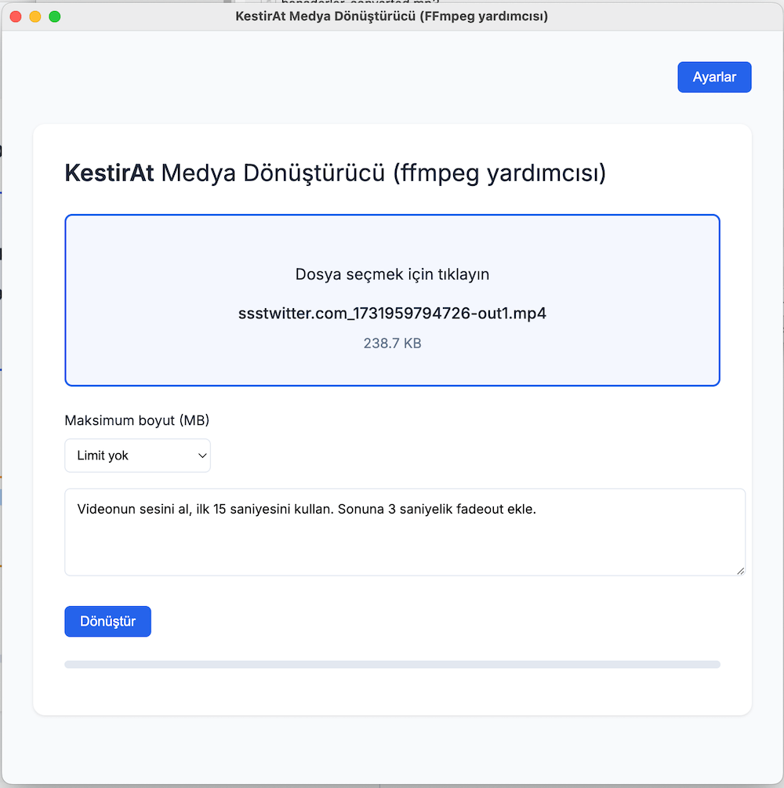

# KestirAt - AI Destekli Medya Dönüştürücü

KestirAt, FFmpeg komutlarını yazmakla uğraşmadan, doğal dil ile medya dosyalarınızı dönüştürmenizi sağlayan basit bir masaüstü uygulamasıdır. Google Gemini AI teknolojisini kullanarak, istediğiniz dönüşüm işlemini anlar ve uygun FFmpeg komutlarını otomatik olarak oluşturup uygular.

## Özellikler

- 🎥 FFMPEG ile video ve ses dosyalarını dönüştürme
- 💬 Doğal dil ile işlem tanımlama
- 🤖 Google Gemini AI ile otomatik komut oluşturma
- 📊 Dosya boyutu sınırlama seçeneği

## Kurulum

1. Projeyi klonlayın:

git clone https://github.com/kullaniciadi/kestir-at.git
cd kestir-at

2. Bağımlılıkları yükleyin:
npm install

3. Google Gemini API anahtarı alın:
   - [Google AI Studio](https://makersuite.google.com/app/apikey) adresine gidin
   - Yeni bir API anahtarı oluşturun
   - Oluşturduğunuz anahtarı uygulamanın Ayarlar kısmına girin

4. Uygulamayı başlatın:
npm start

## Kullanım

1. Ana sayfada "Dosya seçmek için tıklayın" alanına tıklayarak bir medya dosyası seçin
2. İsterseniz "Maksimum boyut" seçeneğinden çıktı dosyası için bir boyut sınırı belirleyin
3. Metin alanına yapmak istediğiniz işlemi açıklayın, örneğin:
   - "videoyu siyah beyaz yap"
   - "videonun ilk 3 saniyesini ve son 10 saniyesini kırp"
   - "videonun sesinin ilk 30 saniyesini ayrı bir dosya olarak kaydet, sonuna 5 saniyelik fadeout ekle"
4. "Dönüştür" düğmesine tıklayın ve işlemin tamamlanmasını bekleyin
5. Her şey yolunda giderse, orijinal dosyanın bulunduğu klasörde, dosyaismi-converted.mp4 şeklinde bir çıktı elde edeceksiniz.
6. Bir sorun oluştuğunda terminalden komut çıktısını takip edebilirsiniz.

## Gereksinimler

- Node.js (v14 veya üzeri)
- npm (v6 veya üzeri)
- Google Gemini API anahtarı

## Teknik Detaylar

- Electron tabanlı masaüstü uygulaması
- Google Gemini AI API entegrasyonu
- FFmpeg için yerleşik destek
- Otomatik dosya yönetimi

## Lisans

ISC

## Katkıda Bulunma

1. Bu depoyu fork edin
2. Yeni bir branch oluşturun (`git checkout -b yeni-ozellik`)
3. Değişikliklerinizi commit edin (`git commit -am 'Yeni özellik: XYZ'`)
4. Branch'inizi push edin (`git push origin yeni-ozellik`)
5. Pull Request oluşturun

## İletişim

Sorularınız veya önerileriniz için bir Issue açabilirsiniz.
